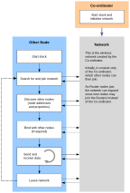

# Application coding with ZigBee PRO APIs

This chapter outlines how to use functions of the NXP ZigBee PRO APIs to perform common operations required in a ZigBee PRO wireless network application.

The operations covered in this chapter are divided into the following areas:

-   Forming a ZigBee PRO wireless network \([Section 6.1](forming_and_joining_a_network.md)\)
-   Discovering the properties of the formed network \([Section 6.2](discovering_the_network.md)\)
-   Managing group addresses \([Section 6.3](managing_group_addresses.md)\)
-   Binding nodes for easy communication between them \([Section 6.4](binding_001.md)\)
-   Transferring data between nodes \([Section 6.5](transferring_data.md)\)
-   Leaving and rejoining the network \([Section 6.6](leaving_and_rejoining_the_network.md)\)
-   Return codes and extended error handling \([Section 6.7](return_codes_and_extended_error_handling.md)\)
-   Implementing ZigBee security \([Section 6.8](implementing_zigbee_security.md)\)
-   Using support software features - message queues and timers \([Section 6.9](using_support_software_features.md)\)
-   Using advanced features \([Section 6.10](advanced_features.md)\)

Many of the functions referenced in this chapter are non-blocking functions that submit a request to the relevant node\(s\) of the network and then return - these functions have **Request** or **Req** in their names. The recipient of the request normally replies by sending a response to the node that initiated the request. Once received, this response message can be collected using the function **ZQ\_bZQueueReceive\(\)** - see [General queue management](general_queue_management.md).

The ZigBee PRO API functions mentioned in this chapter are fully detailed in *Part II Reference Information \(chapter 7 to chapter 12\)*. See [Organization of this manual](organization_of_this_manual.md).

**Note:** Further assistance in developing your own ZigBee 3.0 applications is provided in a range of NXP Application Notes \(see Section 5.2, [Zigbee application support resources](zigbee_application_support_resources.md)\).

The main stages of the life-cycle of a wireless network are illustrated in the figure below. These stages incorporate many of the high-level operations described in this chapter.

**Wireless Network Life-cycle**




```{include} ../topics/forming_and_joining_a_network.md
:heading-offset: 1
```

```{include} ../topics/discovering_the_network.md
:heading-offset: 1
```

```{include} ../topics/managing_group_addresses.md
:heading-offset: 1
```

```{include} ../topics/binding_001.md
:heading-offset: 1
```

```{include} ../topics/transferring_data.md
:heading-offset: 1
```

```{include} ../topics/leaving_and_rejoining_the_network.md
:heading-offset: 1
```

```{include} ../topics/return_codes_and_extended_error_handling.md
:heading-offset: 1
```

```{include} ../topics/implementing_zigbee_security.md
:heading-offset: 1
```

```{include} ../topics/using_support_software_features.md
:heading-offset: 1
```

```{include} ../topics/advanced_features.md
:heading-offset: 1
```

