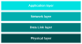

# Architectural overview

This section introduces the basic architecture of the software that runs on a ZigBee PRO network node. The software architecture is built on top of IEEE 802.15.4, an established and proven standard for wireless communication.

From a high-level view, the software architecture of any ZigBee network consists of four basic stack layers: Application layer, Network layer, Data Link layer and Physical layer. The Application layer is the highest level and the Physical layer is the lowest level, as illustrated in the figure below.

**Basic software architecture**

The basic layers of the ZigBee software stack are described below, from top to bottom:

-   <strong>Application layer:</strong> The Application layer contains the applications that run on the network node. These give the device its functionality - essentially an application converts input into digital data, and/or converts digital data into output. A single node may run several applications - for example, an environmental sensor may contain separate applications to measure temperature, humidity and atmospheric pressure.
-   <strong>Network layer:</strong> The Network layer provides the ZigBee PRO functionality and the application’s interface to the IEEE 802.15.4 layers. The layer is concerned with network structure and multi-hop routing.
-   <strong>Data Link layer:</strong> The Data Link layer is provided by the IEEE 802.15.4 standard and is responsible for addressing - for outgoing data it determines where the data is going, and for incoming data it determines where the data has come from. It is also responsible for assembling data packets or frames to be transmitted and disassembling received frames. In the IEEE 802.15.4 standard, the Data Link layer is referred to as IEEE 802.15.4 MAC \(Media Access Control\) and the frames used are MAC frames.
-   <strong>Physical layer:</strong> The Physical layer is provided by the IEEE 802.15.4 standard and is concerned with the interface to the physical transmission medium \(radio, in this case\). It is facilitates exchange of data bits with this medium, as well as with the layer above \(the Data Link layer\). In the IEEE 802.15.4 standard, the Physical layer is referred to as IEEE 802.15.4 PHY.

For a more detailed view of the software architecture of ZigBee PRO, refer to Section 3.7, [Detailed architecture](detailed_architecture.md).

**Note:** Security measures are implemented throughout the stack, including the Application layer and lower stack layers.

**Parent topic:**[ZigBee PRO architecture and operation](../topics/zigbee_pro_architecture_and_operation.md)

