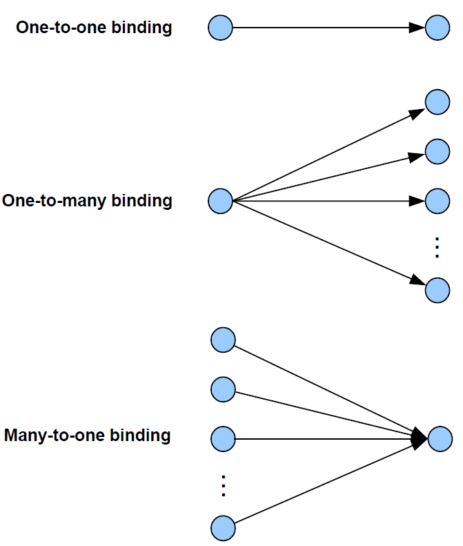

# Binding

Once two nodes have been found to be compatible through Service Discovery \(see [Section 3.6.1](service_discovery.md)\), they may be paired for communication purposes. For example, a light- switch may be paired with a particular light, and we must ensure that this light-switch only ever switches the light that it is intended to control. An easy way to pair nodes for communication is provided by the binding mechanism.

Binding allows nodes to be paired in such a way that a certain type of output data from one node is automatically routed to the paired node, without the need to specify the destination address and endpoint every time. The two nodes must first be bound together using the address and relevant endpoint number for each node - these can be obtained through Service Discovery, described in [Section 3.6.1](service_discovery.md). A binding has a source node and a destination node, relating to the direction in which data is sent between the nodes \(from source to destination\). The details of a binding are stored as an entry in a binding table, normally held on the source node of the binding or sometimes on another nominated node.

In order to establish a binding, it must be requested in either of the following ways:

-   Binding request is submitted to the source node for the binding by either the source node itself or a remote node \(not one of the nodes to be bound\).
-   Binding requests are submitted to the Coordinator by the source and destination nodes for the binding \(for example, by pressing a button on each node to generate a binding request\). The two binding requests must be received within a certain timeout period.

During the binding process, the Binding table for the source node is updated or, if necessary, created.

Binding occurs at the application level using clusters \(described in [Section 3.4.5](clusters_and_attributes.md)\). In order for two applications to be bound, they must support the same cluster.

The binding between two applications is specified by:

-   The node address and endpoint number of the source of the binding \(for example, a light-switch\).
-   The node address and endpoint number of the destination of the binding \(for example, the load controller for a light\).
-   The cluster ID for the binding.

The following types of binding can be achieved:

-   <strong>One-to-one:</strong> This is a simple binding in which an endpoint is bound to one \(and only one\) other endpoint, requiring a single Binding table entry.
-   <strong>One-to-many:</strong> This is a binding in which a source endpoint is bound to more than one destination endpoint. The binding is achieved by having multiple Binding table entries for the same source endpoint.
-   <strong>Many-to-one:</strong> This is a binding in which more than one source endpoint is bound to a single destination endpoint. The binding is achieved by multiple nodes having one-to-one bindings for the same destination endpoint.

These are illustrated in the figure below.

As an example of these bindings, consider a switch and load controller for lighting:

-   In the one-to-one case, a single switch controls a single light
-   In the one-to-many case, a single switch controls several lights
-   In the many-to-one case, several switches control a single light, such as a light on a staircase, where there are switches at the top and bottom of the stairs, either of which can be used to switch on the light

It is also possible to envisage many-to-many bindings where in the last scenario there are several lights on the staircase, all of which are controlled by either switch.

The way bindings are configured depends on the type of network \(described in [Section](easy_installation_and_configuration.md)[2.6](easy_installation_and_configuration.md)\), as follows:

-   <strong>Pre-configured system:</strong> Bindings are factory-configured and stored in the application image.
-   <strong>Self-configuring system:</strong> Bindings are automatically created during network installation using discovery software that finds compatible nodes/clusters.
-   <strong>Custom system:</strong> Bindings are created manually by the system integrator or installation technician, who may use a graphical software tool to draw binding lines between clusters on nodes.

**Parent topic:**[Network communications](../topics/network_communications.md)

