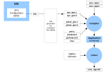

# Configuration principles

The build process for a ZigBee PRO application takes a number of configuration files, in addition to the application source file and header file. The following files are generated from the MCUXpresso IDE to feed into the build process:

-   ZigBee PRO Stack files:
    -   zps\_gen.c

    -   zps\_gen.h

-   PDUM files:
    -   pdum\_gen.c

    -   pdum\_gen.h

-   Other files:
    -   port.c

    -   portasm.h

    -   portmacro

    -   irq.s

**Parent topic:**[ZPS Configuration Editor](../topics/zps_configuration_editor.md)

