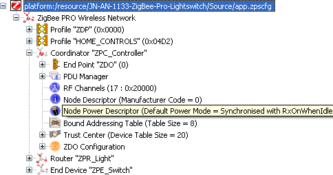

# Coordinator

The Coordinator entry contains a name and a number of associated parameters, mainly related to the APS and NWK layers of the ZigBee PRO stack.

The child entries for the Coordinator are shown above and include the following:

-   Endpoint entries, one for each endpoint on the Coordinator, with each endpoint having child entries specifying the input and output clusters used \(note that each input cluster must be paired with an APDU\).
-   PDU Manager, with child entries specifying the APDUs used.
-   Channel Mask, specifying the 2.4-GHz band channels to scan when creating the network.
-   Node Descriptor for the Coordinator.
-   Node Power Descriptor for the Coordinator.

**Parent topic:**[Overview of ZPS Configuration Editor Interface](../topics/overview_of_zps_configuration_editor_interface.md)

