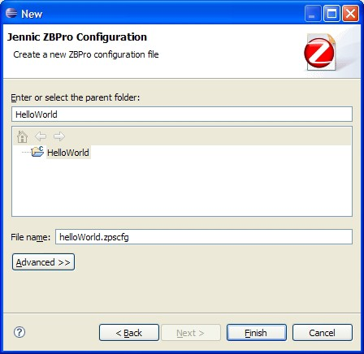
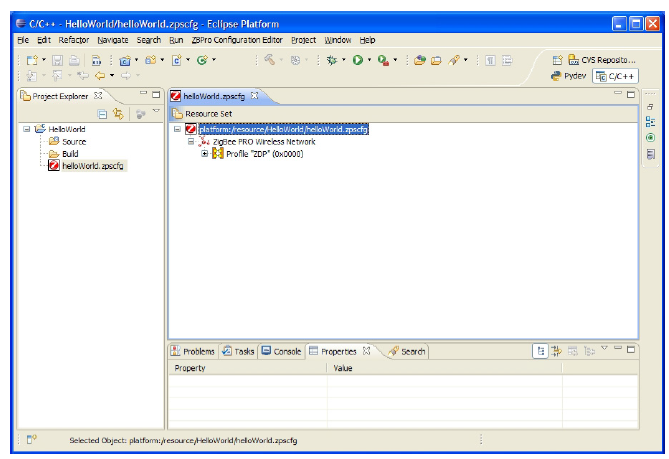

# Creating a New ZPS Configuration

**_Step 1:_** In MCUXpresso, start the ZPS Configuration Editor wizard. To do this, follow the menu path **File &gt; New &gt; Other** and in the **Select a Wizard** dialogue box, select "Jennic ZBPro Configuration" and click **Next**\(shown in Figure 13 on page 283\).

The **New** dialogue box opens for the ZBPro Configuration.

**New ZPS Configuration**

**_Step 2:_** Click on your project to select it as the parent folder. In the **File name**field, enter a name for the configuration file \(keep the extension **.zpscfg**\) and then click **Finish**.

A new configuration \(with the default set of parameters\) will open in the editor, as shown below.

**ZPS Configuration Editor Window**

**Parent topic:**[Using the ZPS Configuration Editor](../topics/using_the_zps_configuration_editor.md)

