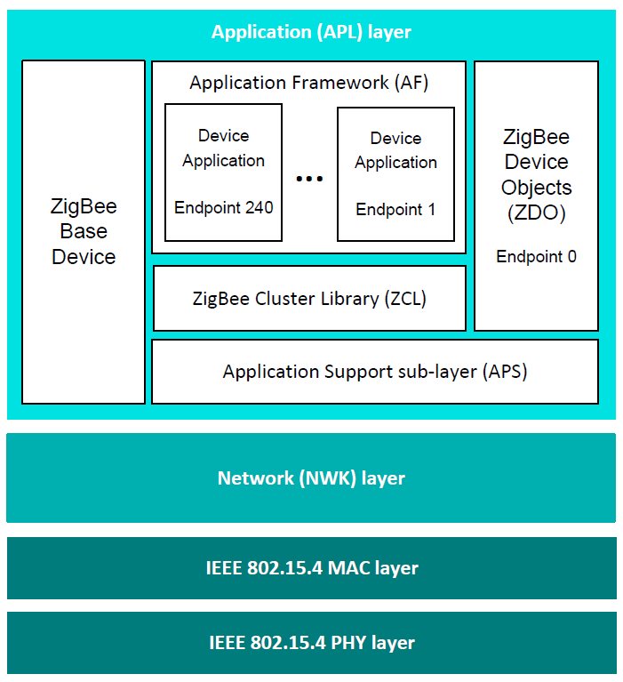

# Detailed architecture

This section elaborates on the simplified software architecture presented in "[Section 3.1](architectural_overview.md)". The detailed architecture is illustrated in the figure below.

**Detailed software architecture**




```{include} ../topics/software_levels.md
:heading-offset: 2
```

**Parent topic:**[ZigBee PRO architecture and operation](../topics/zigbee_pro_architecture_and_operation.md)

