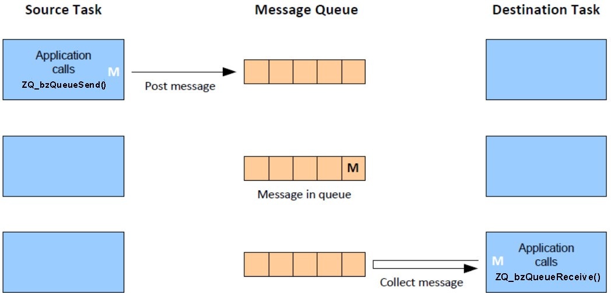

# General queue management

A queue can be created using the function **ZQ\_vZQueueCreate\(\)**. This function allows the queue size \(number of messages that it can hold\) and the size of a message to be specified. A queue is given a unique handle, which is a pointer to a `tszQueue`structure containing up-to-date information about the queue \(see [Section](tszqueue.md)[101.2.1](tszqueue.md)\).

A message can be placed in a \(created\) queue using the function **ZQ\_bZQueueSend\(\)** and a message can be retrieved from a queue using the function **ZQ\_bZQueueReceive\(\)**. This is illustrated in the following figure.

**Sending/Receiving a Message via a Message Queue**

When the above two functions are called, the `tszQueue`structure for the queue is automatically updated to reflect the new state of the queue. Retrieving a message results in the message being deleted from the queue. The application must regularly poll a message queue through which it expects to receive messages. It can do this by periodically calling the **ZQ\_bQueueIsEmpty\(\)** function, which checks whether the queue is empty. If the queue is not empty, it should call **ZQ\_bZQueueReceive\(\)** until there are no more messages in the queue. The number of messages currently waiting to be collected from the queue can be obtained using the function **ZQ\_u32QueueGetQueueMessageWaiting\(\)**.

**Parent topic:**[Message queues](../topics/message_queues.md)

