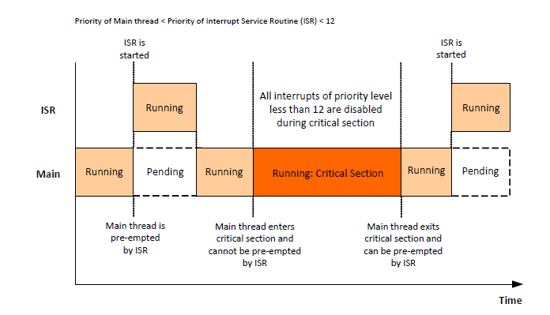

# Implementing a critical section

Interrupts with a priority level less than 12 cannot preempt the execution of a critical section of application code \(though higher-priority interrupts can always preempt a critical section\). This is illustrated in [Figure 14](critical_section_illustration.md) below, which shows the interplay between the main application thread and an interrupt service routine \(ISR\).

**Priority of Main thread &lt; Priority of Interrupt Service Routine \(ISR\) &lt; 12**

**Critical Section Illustration**




```{include} ../topics/critical_section_illustration.md
:heading-offset: 4
```

**Parent topic:**[Critical sections and Mutual Exclusion \(Mutex\)](../topics/critical_sections_and_mutual_exclusion_mutex.md)

