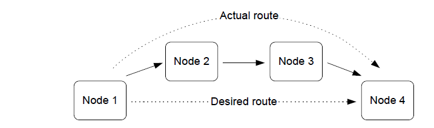

# Network routing

The basic operation of a network is to transfer data from one node to another. The data is sourced from an input \(possibly a switch or a sensor\) on the originating node, and is communicated to another node which can interpret and use the data.

In the simplest data communication, the data is transmitted directly from the source node to the destination node. However, if the two nodes are far apart or in a difficult environment, direct communication may not be possible. In this case, it is necessary to send the data to another node within radio range, which then passes it on to another node, and so on until the desired destination node is reached - that is, to use one or more intermediate nodes as stepping stones. The process of receiving data destined for another node and passing it on is known as routing.

**Message routing**



Routing allows the range of a network to be extended beyond the distances supported by direct radio communication. Remote devices can join the network by connecting to a Router.

**Note:** Application programs in intermediate nodes are not aware of the relayed message or its contents - the relaying mechanism is handled by the ZigBee stack.


```{include} ../topics/message_addressing_and_propagation.md
:heading-offset: 2
```

```{include} ../topics/route_discovery.md
:heading-offset: 2
```

```{include} ../topics/many-to-one_routing.md
:heading-offset: 2
```

**Parent topic:**[ZigBee PRO architecture and operation](../topics/zigbee_pro_architecture_and_operation.md)

