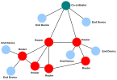

# Network topology

The ZigBee PRO standard was designed to facilitate wireless networks with the Mesh topology.

A Mesh network consists of a Coordinator, Routers, and End Devices. The Coordinator is associated with a set of Routers and End Devices - its children. A Router may then be associated with more Routers and End Devices - its children. This can continue to a number of levels. The relationships between the nodes must obey the following rules:

-   The Coordinator and Routers can have children, and can therefore be parents.
-   A Router can be both a child and a parent.
-   End Devices cannot have children, and therefore cannot be parents. The communication rules for a Mesh network are as follows:
-   An End Device can only directly communicate with its parent \(and with no other node\).
-   A Router can directly communicate with its children, with its own parent, and with any other Router or Coordinator within radio range.
-   The Coordinator can directly communicate with its children and with any Router within radio range.

The resulting structure is illustrated in the figure below.

**Mesh topology**

In ZigBee PRO, the maximum depth \(number of levels below the Coordinator\) of a network is 15. The maximum number of hops that a message can make in traveling between the source and destination nodes is 30 \(twice the maximum depth\).

A routing node \(Router or Coordinator\) can communicate directly with other routing nodes within radio range. This specific property distinguishes a Mesh network from a Tree network. This property enables very efficient and flexible message propagation. It also implies that alternative routes can be found if a link fails or there is congestion.

**Note:** An End Device, which is able to sleep, is unable to receive messages directly. A message destined for a sleep-enabled End Device is always buffered in its parent node if the End Device is asleep when the message arrives. Once the End Device is awake, it must ask or ‘poll’ the parent for messages. In the Mesh topology, a 'route discovery' feature is provided, which allows the network to find the best available route for a message. Refer further details in Section 3.5.2, "**[Route discovery](route_discovery.md)"**.

**Note:** Message propagation is handled by the network layer software and is transparent to the application programs running on the nodes.

**Parent topic:**[Network level concepts](../topics/network_level_concepts.md)

