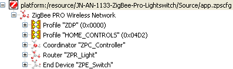

# Overview of ZPS Configuration Editor Interface

The ZPS Configuration Editor allows ZigBee network parameters to be configured through an easy-to-use Windows Explorer-style interface. This interface is outlined below.

The parameter values for the whole network are stored in a file with extension **.zpscfg**, and the ZPS Configuration Editor provides a convenient way to view and edit the contents of this file.

The network parameters are presented in an expandible tree, as shown below.

**Network Parameters**



The information under each of these entries is described below.

Entries that sit at the same level in the tree are termed ‘siblings’, while an entry that sits under another entry in the tree \(a sub-entry\) is termed a ‘child’.

The top level of the tree shows the Extended PAN ID. The next level shows the following siblings:

-   Entries for the ZigBee application profiles used in the network
-   Entry for the Coordinator
-   Entries for the Routers
-   Entries for the End Devices


```{include} ../topics/profile.md
:heading-offset: 2
```

```{include} ../topics/coordinator_001.md
:heading-offset: 2
```

```{include} ../topics/router.md
:heading-offset: 2
```

```{include} ../topics/end_device_001.md
:heading-offset: 2
```

**Parent topic:**[ZPS Configuration Editor](../topics/zps_configuration_editor.md)

