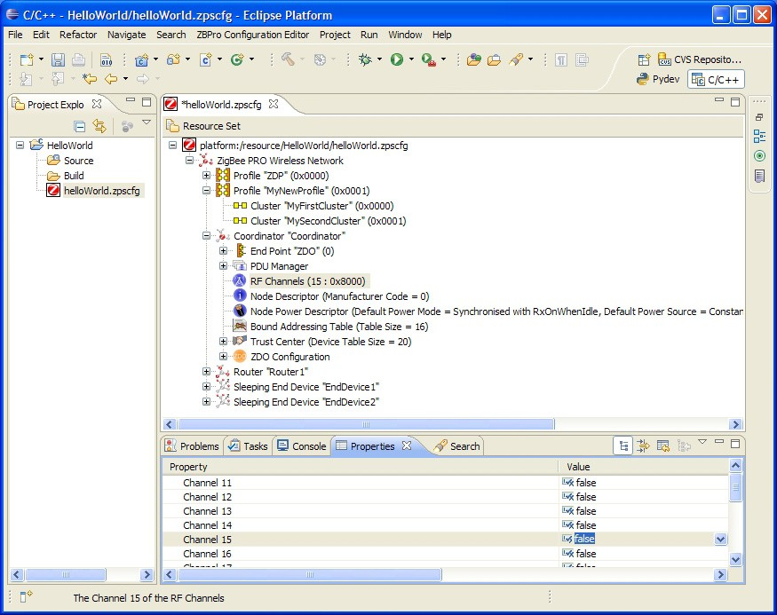

# Setting Coordinator properties

**To set the channel mask and Node Power descriptor, use the below steps:**

**_Step 1:_** Expand the Coordinator node in the editor. This reveals the default set of features for the Coordinator, ZDO endpoint, and ZDO servers.

**_Step 2:_** Click on the **RF Channels** element to modify the channel mask.

There are 16 channels available, numbered 11 to 26, which are now shown in the **Properties** tab. A single channel or a set of channels can be selected for the channel mask, as required.

**_Step 3:_** In the **Properties** tab, set the desired channel\(s\) to true \(by right-clicking on the value and using the drop-down box\).

**Channel Mask Selection**



**_Step 4:_** Click to select the **Node Power Descriptor**.

**_Step 5:_** Edit the properties in the **Properties** tab, as required.


```{include} ../topics/to_add_a_new_endpoint.md
:heading-offset: 3
```

```{include} ../topics/to_add_an_apdu.md
:heading-offset: 3
```

```{include} ../topics/to_add_input_and_output_clusters_to_an_endpoint.md
:heading-offset: 3
```

**Parent topic:**[Using the ZPS Configuration Editor](../topics/using_the_zps_configuration_editor.md)

