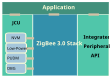

# Software overview

The NXP ZigBee 3.0 software provides all components of the ZigBee stack detailed in Section 2.7, [Detailed architecture](detailed_architecture.md). In addition, it includes the JN51xx Core Utilities \(JCU\). The basic architecture of this software, in relation to the wireless network application, is illustrated in the figure below.

**Overview of NXP ZigBee software architecture**



The NXP ZigBee 3.0 software includes Application Programming Interfaces \(APIs\) to facilitate simplified application development for wireless networks. These APIs consist of C functions that can be incorporated directly in application code.

Two general categories of API are supplied:

-   ZigBee PRO APIs - see [ZigBee PRO APIs](zigbee_pro_apis.md)
-   JCU APIs - see [JCU APIs](jcu_apis.md)

The above figure also shows the Integrated Peripherals API that can be used to interact with the on-chip hardware peripherals of the device. This API is described in the MCUXpresso SDK API Reference Manual \(\(*MCUXSDKJN5189APIRM* or *MCUXSDKK32W041APIRM*\).

In addition, the ZigBee Cluster Library \(ZCL\) provides APIs for the individual clusters, as well as more general ZCL functions. The ZCL is located within the stack block.

All the above APIs are supplied in the ZigBee 3.0 Software Developer’s Kit \(SDK\). For more details on the SDK, refer to [Section 5.1](development_environment_and_resources.md), [Development environment and resources](development_environment_and_resources.md)\)*.*


```{include} ../topics/zigbee_pro_apis.md
:heading-offset: 2
```

```{include} ../topics/jcu_apis.md
:heading-offset: 2
```

**Parent topic:**[ZigBee Stack Software](../topics/zigbee_stack_software.md)

