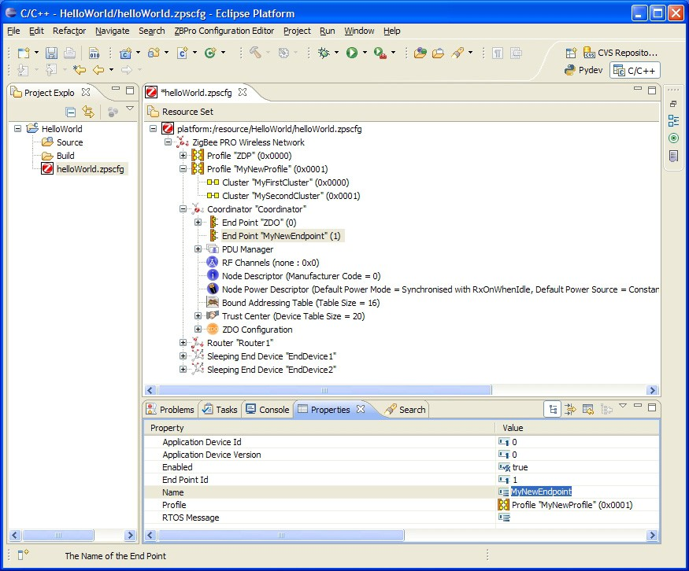

# To add a new endpoint

**_Step 1:_** Right-click on the Coordinator node and select **New Child &gt; End Point** from the drop-down menu.

**_Step 2:_** Edit the properties in the **Properties** tab to set **Name** and **Profile** for the endpoint \(the profile is selected from the drop-down box\).

**_Step 3:_** Repeat Steps 1 and 2 for as many endpoints as are required.

**Endpoint Properties**

**Parent topic:**[Setting Coordinator properties](../topics/setting_coordinator_properties.md)

