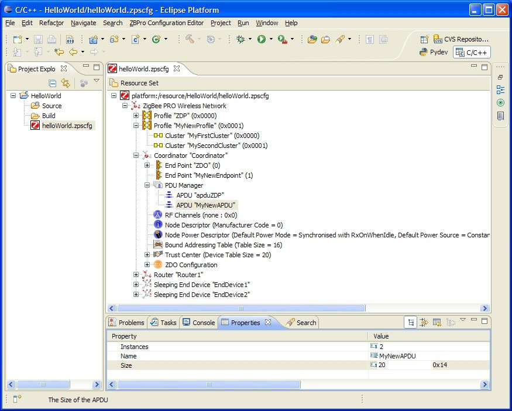

# To add an APDU

At least one APDU is required before an endpoint can send or receive data. The same APDU can be used to send and receive data, or different APDUs can be set up for send and receive - this allows control of buffering and memory resources, and is the decision of the application designer.

**_Step 1:_** Right-click on **PDU Manager** and select **New Child &gt; APDU** from the drop-down menu.

**_Step 2:_** Edit the properties in the **Properties** tab to set **Name**, **Instances** \(number of\) and **Size** \(of each instance - this should be set to the size of the largest APDU to be received\).

**Parent topic:**[Setting Coordinator properties](../topics/setting_coordinator_properties.md)

