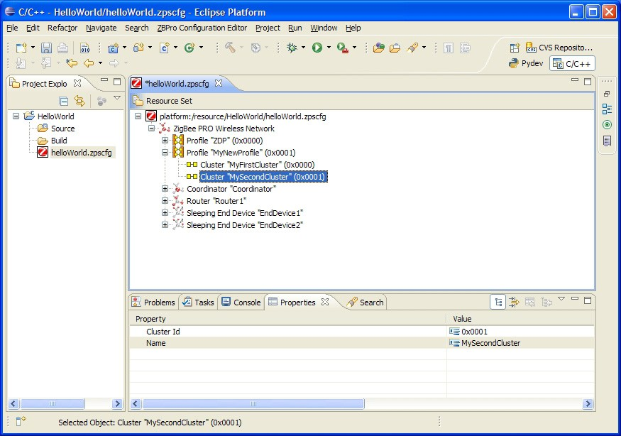

# To add clusters to the new profile

**_Step 1_** Right-click on the new profile created above and select **New Child &gt; Cluster** from the drop-down menu.

**_Step 2_** Edit the properties in the **Properties** tab to set **Name**and **Id** for the new cluster.

**_Step 3_** Repeat Step 1 and Step 2 to add more clusters, as required.

**Parent topic:**[Adding Device Types](../topics/adding_device_types.md)

