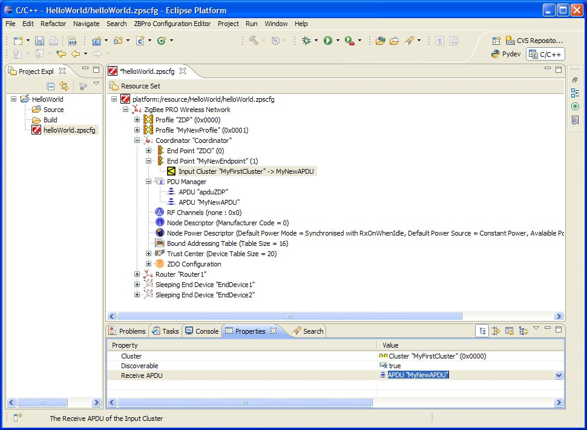

# To add input and output clusters to an endpoint

**To add input and output clusters to an endpoint**

**_Step 1:_** Right-click on the endpoint and select **New Child &gt; Input Cluster**or **New Child &gt; Output Cluster**, as required, from the drop-down menu.

**_Step 2:_** Edit the properties in the **Properties**tab to set **Cluster**- select from the available clusters in the drop-down list.

**_Step 3:_** Edit the **Rx APDU**or **Tx APDU**property to assign an APDU to the cluster - select from the available APDUs in the drop-down list.

To receive data, a cluster must have an assigned APDU. The same cluster can be both an input and output cluster, i.e. it will both send and receive data.

When an endpoint with an output cluster sends data, the receiving endpoint must have an input cluster in order to receive the data, otherwise the stack will reject it and will not notify the receiving endpoint. However, the Default cluster can be added to the endpoint in order to deal with received data that is destined for input clusters not supported by the endpoint \(see the Note below this procedure\).

**_Step 4:_** Repeat Step 1 to Step 3 to add as many clusters as are required for the endpoint.

**_Step 5:_** Repeat Step 1 to Step 4 for Routers and End Devices, as required.

**Note:** In the above procedure, you may want to add the Default cluster \(with a Cluster ID of 0xFFFF\) as an input cluster. The inclusion of the Default cluster means that received messages that were intended for input clusters not supported by the endpoint will still be passed to the application. The messages must, however, come from defined application profiles, otherwise they are discarded.

**Parent topic:**[Setting Coordinator properties](../topics/setting_coordinator_properties.md)

