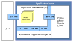

# ZigBee PRO APIs

The ZigBee PRO APIs are concerned with network-specific operations and easy interaction with the ZigBee PRO stack from the application code. These C-function APIs are supplied in the ZigBee 3.0 SDK \(see [Section 5.1](development_environment_and_resources.md), [Development environment and resources](development_environment_and_resources.md)\)*.*

There are three ZigBee PRO APIs:

-   **ZigBee Device Objects \(ZDO\) API:** Concerned with the management of the local device \(for example, introducing the device into a network\)
-   **ZigBee Device Profile \(ZDP\) API:** Concerned with the management of remote devices \(for example, device discovery, service discovery, binding\)
-   **Application Framework \(AF\) API:** Concerned with creating data frames for transmission and modifying device descriptors

The locations of these APIs, as well as the JCU and ZCL APIs, are illustrated in the figure below.

**Locations of ZigBee 3.0 APIs**

**Note:** The C functions of all the ZigBee PRO APIs are fully detailed in Part II: Reference Information of this manual.

**Parent topic:**[Software overview](../topics/software_overview.md)

