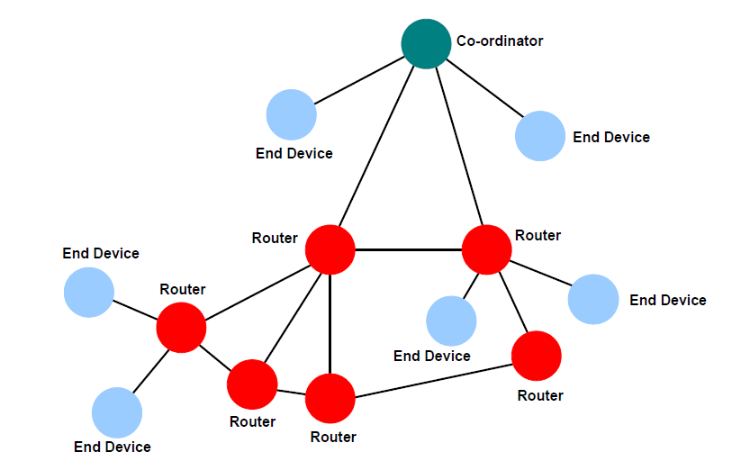

# ZigBee PRO network topology

ZigBee facilitates a range of network topologies from the simplest Star topology, through the highly structured Tree topology to the flexible Mesh topology. ZigBee PRO is designed primarily for Mesh networks.

A Mesh network has little implicit structure. It is a collection of nodes comprising a Coordinator and a number of Routers and/or End Devices, where:

-   Each node, except the Coordinator, is associated with a Router or the Co- ordinator - this is the node through which it joined the network and is known as its ‘parent’. Each parent may have a number of ‘children’.
-   An End Device can only communicate directly with its own parent.
-   Each Router and the Coordinator can communicate directly with any other Router/Coordinator within radio range.

It is the last property above that gives a Mesh network its flexibility and efficiency in terms of inter-node communication. A Mesh network is illustrated in the figure below.

**Simple Mesh Network**

**Parent topic:**[ZigBee overview](../topics/zigbee_overview.md)

