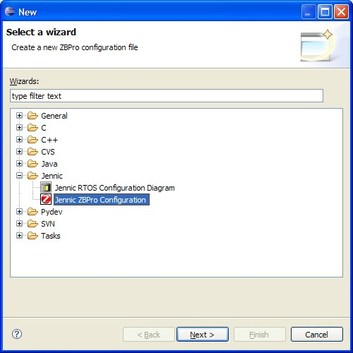

# ZPS Configuration Editor wizard

Before you can start to create a new ZigBee PRO stack configuration, the ZPS Configuration Editor plug-in must be installed in MCUXpresso.

To check if the plug-in is already installed, start MCUXpresso and select

**File &gt; New &gt; Other** from the main menu. Check that a **Jennic** option exists in the **Select a Wizard** dialogue box - expanding the **Jennic** option should show "ZBPro Configuration", as illustrated in the screenshot below.

**Selecting a Wizard**

Using the wizard highlighted in the screenshot above, you can start to create a new ZigBee PRO configuration, as described in [Section 12.4.1](creating_a_new_zps_configuration.md).

If the wizard is not present, install the ZPS Configuration Editor plug-in, which is supplied in the ZigBee 3.0 SDK.

**Parent topic:**[ZPS Configuration Editor](../topics/zps_configuration_editor.md)

