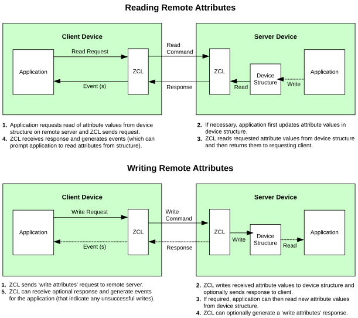

# Shared device structure

The basic operations in a ZigBee 3.0 network are concerned with reading and setting the attribute values of the clusters of a device. In each device, attribute values are exchanged between the application and the ZigBee Cluster Library \(ZCL\) by means of a shared structure. This structure is protected by a mutex \(described in the *ZCL User Guide \(JNUG3132\)*\). The structure for a particular device contains structures for the clusters supported by that device.

**Note:** In order to use a cluster which is supported by a device, the relevant option for the cluster must be specified at build-time - see [Compile-time options](compile-time_options.md#).

A shared device structure may be used in either of the following ways:

-   The local application writes attribute values to the structure, allowing the ZCL to respond to commands relating to these attributes.

-   The ZCL parses incoming commands that write attribute values to the structure. The written values can then be read by the local application.

Remote read and write operations involving a shared device structure are illustrated in the figure below. 

As shown in the above figure, the shared device structure is located on the server device, which hosts the cluster server to be accessed. The client device, which performs the remote access, hosts the corresponding cluster client. See 

**Note:** If there are no remote attribute writes, the attributes of a cluster server \(in the shared structure\) on a device are maintained by the local application.

For more detailed descriptions of these operations, refer to the *ZCL User Guide \(JNUG3132\).*

**Parent topic:** [Introduction](../topics/introduction.md)

