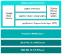

# Software architecture

The figure below shows the basic ZigBee 3.0 software architecture, which illustrates the locations of the ZigBee devices.

For more detailed software architecture information, refer to the *ZigBee 3.0 User Guide \(JNUG3130\)*.

**Parent topic:**[ Introduction](./introduction.md) 

