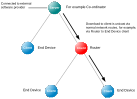

# Basic Principles

Over-the-Air \(OTA\) Upgrade allows the application software on a ZigBee node to be upgraded with minimal disruption to node operation and without physical intervention by the user/installer. For example, there is no need for a cabled connection to the node. Using this technique, the replacement software is distributed to nodes through the wireless network, allowing application upgrades to be performed remotely.

The software upgrade is performed from a node which acts as an OTA Upgrade cluster server, which is able to obtain the upgrade software from an external source. The nodes that receive the upgrade software act as OTA Upgrade cluster clients. The server node and client node\(s\) may be from different manufacturers.

The download of an application image from the server to the network is done on a per client basis and follows normal network routes \(including routing via Routers\). This is illustrated in the figure below.  
**OTA Download Example**
||

The upgrade application is downloaded into Flash memory internal to the device on the client node. Note that the upper section of Flash memory should normally be reserved for persistent data storage - for example, in an 8-sector Flash device, Sector 7 is used for persistent data storage, leaving Sectors 0-6 available to store application software.

The requirements of the devices which act as the OTA Upgrade cluster server and clients are detailed in the sub-sections below. See Connectivity Framework Reference Manual for details of the Non-Volatile Memory Manager \(NVM\).


```{include} ../../OTA_upgrade_cluster/topics/ota_upgrade_cluster_server.md
:heading-offset: 2
```

```{include} ../../OTA_upgrade_cluster/topics/ota_upgrade_cluster_client.md
:heading-offset: 2
```

**Parent topic:**[OTA Upgrade cluster](../../OTA_upgrade_cluster/topics/ota_upgrade_cluster.md)

