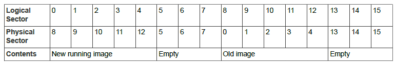
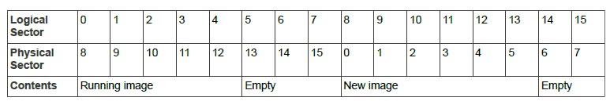
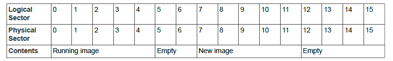
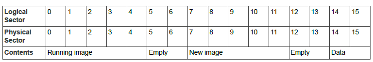
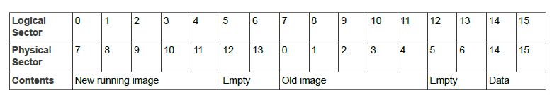

# OTA Upgrade Images in Internal Flash Memory

This section provides guidance on how to organize Over-The-Air \(OTA\) upgrade images in internal Flash memory on the target node \(OTA Upgrade client\). The OTA Upgrade cluster is described in [Chapter 49](ota_upgrade_cluster.md#id_dffd70c3-497c-496f-af07-56b128d01249).

By default, OTA upgrade images are downloaded to a Flash memory device that is internal to the device of the OTA Upgrade client. However, the images can optionally be downloaded directly to devices internal Flash memory - this is enabled using the compile-time option, OTA\_INTERNAL\_STORAGE \(see [Section 49.13](compile-time_options.md#id_97b3e8ab-ab41-4c8b-9817-fc21181c7e31)\).

The function **eOTA\_AllocateEndpointOTASpace\(\)** is used in the application to allocate locations in Flash memory to store application images as part of the OTA upgrade process. The OTA code then uses these locations to store the upgrade image before switching to it, after validation.

There are two issues relating to OTA upgrade and Flash memory remapping:

-   Whether the size of the OTA upgrade binary file is larger than the previous version, such that it must use another sector

-   Where in the memory space the OTA image is written to


Consider the following cases.

We have a 154 KB image \(5 sectors\) and download a new image of the same size, starting at sector 8:

**Case 1 (Sector 8)**
")

When we switch to the new image, the physical sectors are moved in the memory map by the bootloader so that the new image becomes the running image and the previous running image becomes the old image. Only the sectors that must be moved are actually moved by the bootloader, and the other sectors are left alone:

**Case 2**


If we now download a further new image that is 161KB \(6 sectors\) in size, it would replace the old running image and be placed into logical sectors 8 to 13, which are physical sectors 0, 1, 2, 3, 4 and 13. However, this new image is then unusable because the physical sectors are not contiguous and the bootloader does not take this into account when it remaps the memory \(if the new image was less than 160KB, there would be no problem\).

The simple solution to this problem is to replace the remapping that the bootloader has chosen with our own remapping in which logical sector 13 becomes physical sector 5, thus allowing the new image to be stored in contiguous physical sectors \(0 to 5\).

**Case 3**



However, this does not leave any space for permanent data and it also assumes that the new image is stored at logical sector 8.

You may choose to put the new image anywhere in the Flash memory \(ZigBee allows this to be configured, and a user-developed solution is free to do what it requires\). So you need to adjust the remapping to match. For example, if the OTA image was placed at logical sector 7:

**Case 4**


The purpose of this is to leave some sectors at the end of Flash memory for permanent data \(otherwise you could always start the OTA image at sector 8\).

In such cases, the sensible approach is to:

1. Calculate how much permanent data space is required and reserve the end sectors for this data.

2. Divide the remaining space into two equal blocks of sectors

3. Configure the OTA upgrade to start at the beginning of the second block of sectors.

4. Force the remapping to swap the two blocks, regardless of the actual image size.

Consider the example in which a user wants 64KB for permanent data, which requires 2 sectors. This leaves 14 sectors for applications, so we have two blocks of 7 sectors for each application \(even though the application may be smaller than this\):

**Case 5**


To avoid any problem with the new image growing and needing 6 sectors rather than 5 sectors, we force the remapping to swap all 7 sectors over:

**Case 6**


This leaves sectors 14 and 15 in a fixed location.

The code to achieve this is as follows:

```
`     if (u8CurrentImageSector > 0)`
`     { `
`        /* Remapping will not affect the current running image,`
`           which was already running in a continuous block at the base `
`           application Flash address */ `
`        vREG_SysWrite(REG_SYS_FLASH_REMAP,  0x0dcba987); `
`        vREG_SysWrite(REG_SYS_FLASH_REMAP2, 0xfe654321);`
`     }`

```

**Parent topic:**[OTA Upgrade cluster](../../OTA_upgrade_cluster/topics/ota_upgrade_cluster.md)

