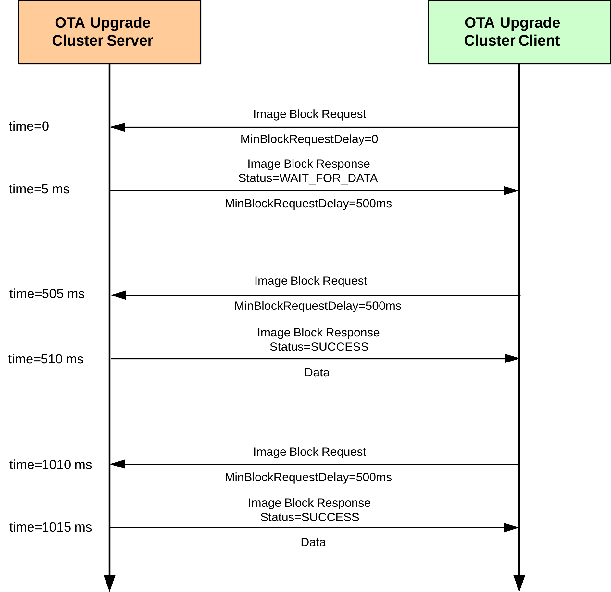

# Rate Limiting

During busy periods when the OTA Upgrade server is downloading images to multiple clients, it is possible to prevent OTA traffic congestion by limiting the download rates to individual clients. This is achieved by introducing a minimum time-delay between consecutive Image Block Requests from a client - for example, if this delay is set to 500 ms for a particular client then after sending one block request to the server, the client must wait at least 500 ms before sending the next block request. This has the effect of restricting the average OTA download rate from the server to the client.

This ‘block request delay’ can be set to different values for different clients. This allows OTA downloads to be prioritized by granting more download bandwidth to some clients than to others. This delay for an individual client can also be modified by the server during a download, allowing the server to react in real-time to varying OTA traffic levels.

The implementation of the above rate limiting is described below and is illustrated in the Figure "Example of Rate limiting exchange" below.


## ‘Block Request Delay’ Attribute 

The download rate to an individual client is controlled using the optional attribute `u16MinBlockRequestDelay` of the OTA Upgrade cluster \(see [Section 49.3](ota_upgrade_cluster_structure_and_attributes.md#id_accc84e1-e4af-4078-b61f-af69b4b4314c)\) on the client. This attribute contains the ‘block request delay’ for the client \(described above\), in milliseconds, and must be enabled on the client only \(see below\).

**Note:** The `u16MinBlockRequestDelay` attribute is the minimum time-interval between block requests. The application on the client can implement longer intervals between these requests \(a slower download rate\), if required.

## Enabling the Rate Limiting Feature 

In order to use the rate limiting feature during an OTA upgrade, the macro OTA\_CLD\_ATTR\_REQUEST\_DELAY must be defined in the **zcl\_options.h** file for both the participating client\(s\). This enables the `u16MinBlockRequestDelay` attribute in the OTA Upgrade cluster structure.

## Implementation in the Server Application 

The application on the OTA Upgrade server device can control the OTA download rate to an individual client by remotely setting the value of the ‘block request delay’ attribute on the client. However, first the server must determine whether the client supports the rate limiting feature. The server can do this in either of two ways:

-   It can attempt to read the `u16MinBlockRequestDelay` attribute in the OTA Upgrade cluster on the client - if rate limiting is not enabled on the client, this read will yield an error.

-   It can check whether the first Image Block Request received from the client contains a ‘block request delay’ field - if present, this value is passed to the application in the event E\_CLD\_OTA\_COMMAND\_BLOCK\_REQUEST.


The server can change the value of the ‘block request delay’ attribute on the client at any time, even during a download. To do this, the server includes the new attribute value in an Image Block Response with status OTA\_STATUS\_WAIT\_FOR\_DATA. This is achieved in the application code through a call to the function **eOTA\_SetWaitForDataParams\(\)** following an Image Block Request \(indicated by an E\_CLD\_OTA\_COMMAND\_BLOCK\_REQUEST event\). The new attribute value specified in this function call is included in the subsequent Image Block Response and is automatically written to the OTA Upgrade cluster on the client.

The server may update the ‘block request delay’ attribute on a client multiple times during a download in order to react to changing OTA traffic conditions. If the server is downloading an image to only one client then it may choose to allow this download to proceed at the full rate \(specified by a zero value of the attribute on the client\). However, if two or more clients request downloads at the same time, the server may choose to limit their download rates \(by setting the attribute to non-zero values on the clients\). The download to one client can be given higher priority than other downloads by setting the attribute on this client to a lower value.

## Implementation in the Client Application 

The application on the OTA Upgrade client device must control a millisecond timer \(a timer with a resolution of one millisecond\) to support rate limiting. This timer is used to time the delay between receiving an Image Block Response and submitting the next Image Block Request.

During an image download, a received Image Block Response with the status OTA\_STATUS\_WAIT\_FOR\_DATA may contain a new value for the ‘block request delay’ attribute \(this type of response may arrive at the start of a download or at any time during the download\). The client will automatically write this new value to the `u16MinBlockRequestDelay` attribute in the local OTA Upgrade cluster structure and will also generate the event E\_ZCL\_CBET\_ENABLE\_MS\_TIMER \(provided that the new attribute value is non-zero\).

The E\_ZCL\_CBET\_ENABLE\_MS\_TIMER event prompts the application to start the millisecond timer for a timed interval greater than or equal to the new value of the ‘block request delay’ attribute. The application can obtain this new attribute value \(in milliseconds\) from the event via:

```
sZCL_CallBackEvent.uMessage.u32TimerPeriodMs

```

The millisecond timer is started for a particular timed interval. The expiry of this timer is indicated by an E\_ZCL\_CBET\_TIMER\_MS event, which is handled as described in [Section 3.2](../../ZCL_event_handling/topics/processing_events.md#id_330793fd-a49c-4aa2-8637-b6fa2de34c38). The client will then send the next Image Block Request.

After sending an Image Block Request:

-   If the client now generates an E\_ZCL\_CBET\_DISABLE\_MS\_TIMER event, this indicates that the last of the Image Block Request \(for the required image\) has been sent and the application should disable the millisecond timer.

-   Otherwise, the application must start the next timed interval \(until the next request\).   
**Example of Rate limiting exchange**



**Parent topic:**[Ancillary Features and Resources for OTA Upgrade](../../OTA_upgrade_cluster/topics/ancillary_features_and_resources_for_ota_upgrade.md)

