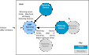
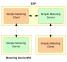

# Mirroring Metering Data

‘Mirroring’ is a facility that stores and provides access to metering data which originates from Metering Devices that sleep. A Metering Device cannot be accessed during periods of sleep and therefore its data cannot normally be read at these times. Mirroring involves holding the data from sleepy Metering Devices centrally on a server, allowing access to the data at all times.

Normally, the ESP \(Co-ordinator\) acts as the mirroring server. One or more sleepy Metering Devices \(End Devices\) can mirror their data on this server. A Metering Device must send its latest data to the mirroring server immediately before entering sleep mode. This is illustrated in the figure below.

**Mirroring of Metering Data**



Every mirror \(one for each Metering Device\) on the mirroring server has its own endpoint. The maximum number of mirror endpoints is defined at compile-time \(see [Section 42.12](compile-time_options.md#id_25334628-dcfd-426f-af0c-8d34a10f08a1)\). Note that these endpoints are in addition to the main endpoint for the ESP \(registered using **eSE\_RegisterEspMeterEndPoint\(\)** or **eSE\_RegisterEspEndPoint\(\)**\).

Mirroring versions of the Simple Metering cluster server and/or client are implemented on the mirror endpoints. This is illustrated in the figure below, where the ESP, as the mirroring server, incorporates both the Simple Metering cluster server and client, the Metering device incorporates a cluster server and the IPD incorporates a cluster client.

**Simple Metering Cluster in Mirroring**  



The ESP device structure `tsSE_EspMeterDevice` contains a section on mirroring support which includes an array of `tsSE_Mirror`         structures \(see [Section 42.11.2](tsse_mirror.md#id_96e1c97f-d9f1-4920-8128-f63067c9e17d)\). This array contains one element/structure per mirror endpoint, with the first mirror endpoint occupying array element 0 and the array size corresponding to the maximum number of mirror endpoints allowed on the mirroring server. The information stored in an array element includes the IEEE address of the Metering Device to which the mirror endpoint has been allocated.


```{include} ../../Simple_Metering_cluster/topics/configuring_mirroring_on_esp.md
:heading-offset: 2
```

```{include} ../../Simple_Metering_cluster/topics/configuring_mirroring_on_metering_devices.md
:heading-offset: 2
```

```{include} ../../Simple_Metering_cluster/topics/mirroring_data.md
:heading-offset: 2
```

```{include} ../../Simple_Metering_cluster/topics/reading_mirrored_data.md
:heading-offset: 2
```

```{include} ../../Simple_Metering_cluster/topics/removing_a_mirror.md
:heading-offset: 2
```

**Parent topic:**[Simple Metering Cluster](../../Simple_Metering_cluster/topics/simple_metering_cluster.md)

