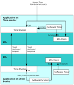

# Time-Synchronization of Devices

The devices in a ZigBee PRO network may need to be time-synchronized \(so that they all refer to the same time\). In this case, the Time cluster is used and one device acts as the Time cluster server and time-master from which the other devices set their time.

**Note:** Synchronization with a time-master is not required in all networks. In such cases, it is sufficient to use the ZCL time without synchronization between devices, as described in [Section 18.4](maintaining_zcl_time.md#id_5b749fdf-f76c-4969-8378-f7a0709cc19c).

There are two times on a device that should be maintained during the synchronisation process:

-   Time attribute of the Time cluster \(`utctTime` field of `tsCLD_Time` structure\)

-   ZCL time


On the time-master, these times are initialized by the local application using an external master time and are subsequently maintained using a local one-second timer \(see [Section 18.5.1](initialising_and_maintaining_master_time.md#id_9f4ac3f8-23f7-418a-928f-bd95ac544f09)\), as well as occasional re-synchronizations with external master time.

On all other devices, these times are initialized by the local application by synchronizing with the time-master \(see [Section 18.5.2](initial_synchronisation_of_devices.md#id_4bb38c31-e047-4417-a555-b6c4243e7b95)\). The ZCL time is subsequently maintained using a local one-second timer and both times are occasionally re-synchronized with the time-master \(see [Section 18.5.3](re-synchronisation_of_devices.md#id_6793b4ef-f442-4cea-ab69-f57f852da7a1)\).

synchronization with the time-master is normally performed via the Time cluster.

CAUTION:

If there is more than one Time cluster server in the network, devices should only attempt to synchronize to one server in order to prevent their clocks from repeatedly jittering backwards and forwards.

The figure below provides an overview of the time initialization and synchronization processes described in the sub-sections that follow.

**Time Initialization and Synchronization**




```{include} ../../Time_cluster/topics/initialising_and_maintaining_master_time.md
:heading-offset: 2
```

```{include} ../../Time_cluster/topics/initial_synchronisation_of_devices.md
:heading-offset: 2
```

```{include} ../../Time_cluster/topics/re-synchronisation_of_devices.md
:heading-offset: 2
```

**Parent topic:**[Time Cluster and ZCL Time](../../Time_cluster/topics/time_cluster_and_zcl_time.md)

