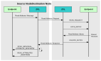

# Reading a set of attributes of a remote cluster

This section describes the use of the function **eZCL\_SendReadAttributesRequest\(\)** to send a ‘read attributes’ request to a remote cluster in order to obtain the values of selected attributes. The resulting activities on the source and destination nodes are outlined below and illustrated in the figure *‘Write Attributes’ Request and Response* below. The events generated from a ‘read attributes’ request are further described in [Chapter 3](../../ZCL_event_handling/topics/event_handling.md#id_dc3930f1-d872-41b9-9d62-e68af6bf28ee).

**Note:** The described sequence is similar when using the cluster-specific ‘read attributes’ functions.

## **1. On Source Node** 

The function **eZCL\_SendReadAttributesRequest\(\)** is called to submit a request to read one or more attributes on a cluster on a remote node. The information required by this function includes the following:

-   Source endpoint \(from which the read request is to be sent\)

-   Address of destination node for request

-   Destination endpoint \(on destination node\)

-   Identifier of the cluster containing the attributes \[enumerations provided\]

-   Number of attributes to be read

-   Array of identifiers of attributes to be read \[enumerations provided\]

## **2. On Destination Node** 

On receiving the ‘read attributes’ request, the ZCL software on the destination node performs the following steps:

1. Generates an `E_ZCL_CBET_READ_REQUEST` event for the destination endpoint callback function which, if required, can update the shared device structure that contains the attributes to be read, before the read takes place.

2. If tasks within the application are not cooperative, the ZCL generates an `E_ZCL_CBET_LOCK_MUTEX` event for the endpoint callback function, which should lock the mutex that protects the shared device structure - for information on mutexes, refer to [Appendix A.](../../appendix/topics/mutex_callbacks.md#id_3604e1a6-d753-4b1f-a7bb-2f6b4334e0d3)

3. Reads the relevant attribute values from the shared device structure and creates a ‘read attributes’ response message containing the read values.

4. If tasks within the application are not cooperative, the ZCL generates an `E_ZCL_CBET_UNLOCK_MUTEX`event for the endpoint callback function, which should now unlock the mutex that protects the shared device structure \(other application tasks can now access the structure\).

5. Sends the ‘read attributes’ response to the source node of the request.

## **3. On Source Node** 

On receiving the ‘read attributes’ response, the ZCL software on the source node performs the following steps:

1. For each attribute listed in the ‘read attributes’ response, it generates an `E_ZCL_CBET_READ_INDIVIDUAL_ATTRIBUTE_RESPONSE` message for the source endpoint callback function, which may or may not take action on this message.

2. On completion of the parsing of the ‘read attributes’ response, it generates a single `E_ZCL_CBET_READ_ATTRIBUTES_RESPONSE` message for the source endpoint callback function, which may or may not take action on this message.
**‘Read Attributes’ Request and Response**
||

**Note:** The ‘read attributes’ requests and responses arrive at their destinations as data messages. Such a message triggers a stack event of the type ZPS\_EVENT\_APS\_DATA\_INDICATION, which is handled as described in [Section 3.2](../../ZCL_event_handling/topics/processing_events.md#id_330793fd-a49c-4aa2-8637-b6fa2de34c38).

**Parent topic:**[Reading Attributes](../../ZCL_fundamentals/topics/reading_attributes.md)

