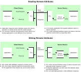

# Shared Device Structures

In each ZigBee device, cluster attribute values are exchanged between the application and the ZCL by means of a shared structure. This structure is protected by a mutex - see [Appendix A.](../../appendix/topics/mutex_callbacks.md#id_3604e1a6-d753-4b1f-a7bb-2f6b4334e0d3) The structure for a particular ZigBee device contains structures for the clusters supported by that device.

**Note:** In order to use a cluster which is supported by a device, the relevant option for the cluster must be specified at build-time - see [Section 1.3](../../ZCL_intro/topics/zcl_compile-time_options.md#id_9a025580-0b33-48c7-b195-7b3e004c4987).

A shared device structure within a device can be accessed both by the local application and by a remote application on another device. Remote read and write operations involving a shared device structure are illustrated in the figure below. Normally, a cluster client requests these operations and they are performed on a cluster server. For more detailed descriptions of these operations, refer to [Section 2.3](accessing_attributes.md#id_9f17ffc2-9472-40fa-9365-07ad9a0f505b).

Usually, the ZCL parses remote commands that write attribute values to the shared device structure. The written values can then be read by the local application. For example, an On/Off Switch device remotely writes to the shared device structure in an On/Off Light device and the local application then reads this data to change the state or configuration of the light.  

**Operations using Shared Device Structure**

**Note:** Provided that there are no remote attribute writes, the attributes of a cluster server \(in the shared structure\) on a device are maintained by the local application\(s\).

**Parent topic:**[ZCL Fundamentals and Features](../../ZCL_fundamentals/topics/zcl_fundamentals_and_features.md)

