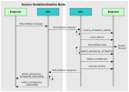

# Writing to Attributes of a Remote Cluster

A ZigBee 3.0 application might require to write attribute values to a remote device. Attribute values are written by sending a ‘write attributes’ request, normally from a client cluster to a server cluster, where the relevant attributes in the shared device structure are updated. Write access to cluster attributes must be explicitly enabled at compile time as described in [Section 1.3](../../ZCL_intro/topics/zcl_compile-time_options.md#id_9a025580-0b33-48c7-b195-7b3e004c4987).

Three ‘write attributes’ functions are provided in the ZCL:

-   **eZCL\_SendWriteAttributesRequest\(\):** This function sends a ‘write attributes’ request to a remote device, which attempts to update the attributes in its shared structure. The remote device generates a ‘write attributes’ response to the source device, indicating success or listing error codes for any attributes that it could not update.

-   **eZCL\_SendWriteAttributesNoResponseRequest\(\):** This function sends a ‘write attributes’ request to a remote device, which attempts to update the attributes in its shared structure. However, the remote device does not generate a ‘write attributes’ response, regardless of whether there are errors.

-   **eZCL\_SendWriteAttributesUndividedRequest\(\):** This function sends a ‘write attributes’ request to a remote device, which checks that all the attributes can be written to without error:

    -   If all attributes can be written without error, all the attributes are updated.

    -   If any attribute is in error, all the attributes are left at their existing values.

        -   The remote device generates a ‘write attributes’ response to the source device, indicating success or listing error codes for attributes that are in error.

The activities surrounding a ‘write attributes’ request on the source and destination nodes are outlined below and illustrated in  1](reading_a_set_of_attributes_of_a_remote_cluster.md#fig2). The events generated from a ‘write attributes’ request are further described in [Chapter 3](../../ZCL_event_handling/topics/event_handling.md#id_dc3930f1-d872-41b9-9d62-e68af6bf28ee).

## 1. On Source Node 

In order to send a ‘write attributes’ request, the application on the source node calls one of the above ZCL ‘write attributes’ functions to submit a request to update the relevant attributes on a cluster on a remote node. The information required by this function includes the following:

-   Source endpoint \(from which the write request is to be sent\)

-   Address of destination node for request

-   Destination endpoint \(on destination node\)

-   Identifier of the cluster containing the attributes \[enumerations provided\]

-   Number of attributes to be written

-   Array of identifiers of attributes to be written \[enumerations provided\]

## 2. On Destination Node 

On receiving the ‘write attributes’ request, the ZCL software on the destination node performs the following steps:

1. For each attribute to be written, generates an E\_ZCL\_CBET\_CHECK\_ATTRIBUTE\_RANGE event for the destination endpoint callback function.

-   If required, the callback function can do either or both of the following:
    -   Check that the new attribute value is in the correct range - if the value is out-of-range, the function should set the `eAttributeStatus` field of the event to E\_ZCL\_ERR\_ATTRIBUTE RANGE
    -   Block the write by setting the the `eAttributeStatus` field of the event to E\_ZCL\_DENY\_ATTRIBUTE\_ACCESS
-   In the case of an out-of-range value or a blocked write, there is no further processing for that particular attribute following the ‘write attributes’ request.

2. If tasks within the application are not cooperative, the ZCL generates an E\_ZCL\_CBET\_LOCK\_MUTEX event for the endpoint callback function, which should lock the mutex that protects the relevant shared device structure - for information on mutexes, refer to [Appendix A.](../../appendix/topics/mutex_callbacks.md#id_3604e1a6-d753-4b1f-a7bb-2f6b4334e0d3)

3. Writes the relevant attribute values to the shared device structure - an E\_ZCL\_CBET\_WRITE\_INDIVIDUAL\_ATTRIBUTE event is generated for each individual attempt to write an attribute value, which the endpoint callback function can use to keep track of the successful and unsuccessful writes.

**Note:** If an ‘undivided write attributes’ request is received, an individual failed write would render the whole update process unsuccessful.

4. Generates an E\_ZCL\_CBET\_WRITE\_ATTRIBUTES event to indicate that all relevant attributes have been processed and, if required, creates a ‘write attributes’ response message for the source node.

5. If tasks within the application are not cooperative, the ZCL generates an E\_ZCL\_CBET\_UNLOCK\_MUTEX event for the endpoint callback function, which should now unlock the mutex that protects the shared device structure \(other application tasks can now access the structure\).

6. If required, sends a ‘write attributes’ response to the source node of the request.

## 3. On Source Node 

On receiving an optional ‘write attributes’ response, the ZCL software on the source node performs the following steps:

1. For each attribute listed in the ‘write attributes’ response, it generates an E\_ZCL\_CBET\_WRITE\_INDIVIDUAL\_ATTRIBUTE\_RESPONSE message for the source endpoint callback function, which may or may not take action on this message. Only attributes for which the write has failed are included in the response and will therefore result in one of these events.

2. On completion of the parsing of the ‘write attributes’ response, it generates a single E\_ZCL\_CBET\_WRITE\_ATTRIBUTES\_RESPONSE message for the source endpoint callback function, which may or may not take action on this message.

||

**Note:** The ‘write attributes’ requests and responses arrive at their destinations as data messages. Such a message triggers a stack event of the type ZPS\_EVENT\_APS\_DATA\_INDICATION, which is handled as described in [Chapter 3](../../ZCL_event_handling/topics/event_handling.md#id_dc3930f1-d872-41b9-9d62-e68af6bf28ee).

**Parent topic:**[Writing Attributes](../../ZCL_fundamentals/topics/writing_attributes.md)

