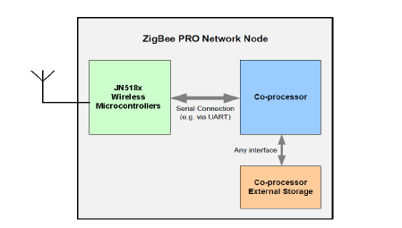
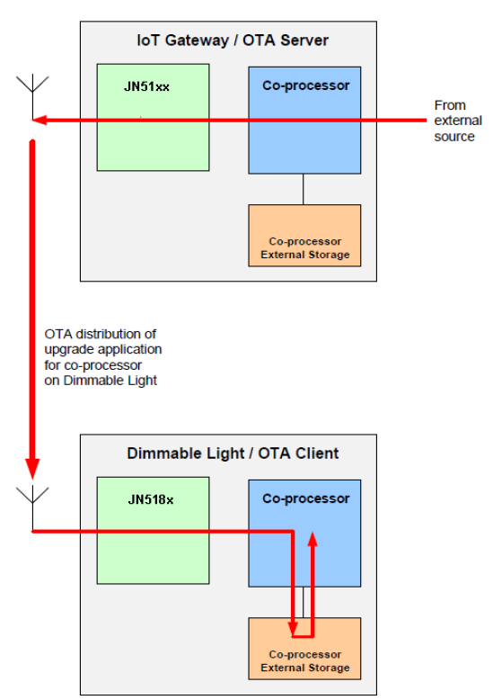

# Appendix F: OTA extension for dual-processor nodes

This appendix describes use of the Over-the-Air \(OTA\) Upgrade cluster \(introduced in [Chapter 49](../../OTA_upgrade_cluster/topics/ota_upgrade_cluster.md#id_dffd70c3-497c-496f-af07-56b128d01249)\) for a ZigBee PRO network consisting of dual-processor nodes that each contain a JN518x, K32W041, K32W061, MCXW71, or MCXW72 wireless microcontroller and a co-processor.

The co-processor is connected to the device via a serial interface and may have its own external storage device, as depicted in the figure below. 

**Dual-Processor Node**
||

The OTA Upgrade cluster may be used to upgrade the application which runs on the co-processor as well as the application which runs on the JN518x, K32W041, K32W061, MCXW71, or MCXW72 device. In this case, the OTA upgrade process is outlined below.

1. On the OTA server node \(which is typically also the ZigBee Co-ordinator\), the co-processor receives a new software image for the ZigBee PRO network.

2. The co-processor on the OTA server node saves the received software image in its own storage device.

3. The OTA Upgrade cluster server running on the JN518x, K32W041, or K32W061 device distributes the software update over-the-air to the appropriate ZigBee PRO network nodes, as described in [Section 49.4](../../OTA_upgrade_cluster/topics/basic_principles.md#id_c94942a4-90ad-4a40-82d4-a3d7ddfb1ef6).

4. On a target node, the OTA Upgrade cluster client running on the JN518x/K32W041/61 microcontroller either stores the received software image in its own Flash memory device or passes it to the co-processor for storage in the co-processor’s own storage device, depending on whether the application in the update is destined for the device or the co-processor.

5. The OTA Upgrade cluster client running on the JN518x, K32W041, or K32W061 device then either performs the upgrade of the application running on itself or signals to the co-processor to initiate an upgrade of its own application, as appropriate.

The above process is illustrated in the figure below for the case of a ZigBee 3.0 network in which the co-processor application on a Dimmable Light \(OTA client\) is updated from an external source via an ‘Internet of Things’ \(IoT\) Gateway \(OTA server\) and the image is stored in the target co-processor’s own storage device.  
**Example of OTA Upgrade of Co-processor Application**
||


```{include} ../../appendix/topics/application_upgrades_for_different_target_processo.md
:heading-offset: 1
```

```{include} ../../appendix/topics/storing_upgrade_images_in_co-processor_storage_on_.md
:heading-offset: 1
```

```{include} ../../appendix/topics/use_of_image_indices.md
:heading-offset: 1
```

