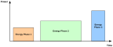

# Power profiles

An appliance can have one or more power profiles. An example of an appliance with multiple power profiles is a washing machine which has a number of programmes for different types of materials and loads.

**Note:** The number of power profiles on a device must be defined in the file **zcl\_options.h** \(see [Section 21.11](compile-time_options.md#id_b8a93293-b412-43d1-a3e6-4800989d0691)\).

An individual power profile comprises a series of energy phases with different power demands. For example, these phases may correspond to the different cycles of a washing machine programme, such as wash, rinse, spin. Details of a power profile, including these energy phases, are held in an entry of the power profile table on the cluster server \(appliance\).

If the appliance is to be remotely controlled, the controller \(cluster client\) must ‘learn’ the details of the appliance’s power profile so that it can control the scheduling of the energy phases. The schedule of a power profile is decided by the client, and includes energy phases and their relative start-times \(the energy phases are not necessarily contiguous in time\). A schedule is illustrated in the figure below. The client must communicate the schedule for a power profile to the server where the schedule is executed.

**Schedule of Energy Phases of a Power Profile**
||

**Parent topic:**[Power Profile Cluster](../../power_profile_cluster/topics/power_profile_cluster.md)

