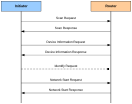

# Creating a network

A network is formed from an initiator node and a Router node \(usually the initiator is an End Device and will have no routing capability in the network\). The Touchlink network creation process is described below and is illustrated in the figure below. (also refer to the command list in the table in the Section [Using Touchlink](using_touchlink.md#table_6ebf31ca-9136-43fd-8da4-20bc355ef70b)\).

**Note:** Received Touchlink requests and responses are handled as ZigBee PRO events. The event handling is not detailed below but is outlined in [Section 44.6](touchlink_commissioning_events.md#id_f14c3fbe-3d56-47d4-b26a-0df6fdc28ad1).

1. **Scan Request:** The initiator sends a Scan Request to nodes in its vicinity. The required function is:  
`eCLD\_ZllCommissionCommandScanReqCommandSend\(\)`

2. **Scan Response:** A receiving node replies to the Scan Request by sending a Scan Response, which includes the device type of the responding node \(e.g. Router\). The required function is:
`eCLD\_ZllCommissionCommandScanRspCommandSend\(\)`

3. **Device Information Request:** The initiator sends a Device Information Request to the detected Routers that are of interest. The required function is:
`eCLD\_ZllCommissionCommandDeviceInfoReqCommandSend\(\)`

4. **Device Information Response:** A receiving Router replies to the Device Information Request by sending a Device Information Response. The required function is:  
`eCLD\_ZllCommissionCommandDeviceInfoRspCommandSend\(\)`

5. **Identify Request \(Optional\):** The initiator may send an Identify Request to the node which has been chosen as the first Router of the new network, in order to confirm that the correct physical node is being commissioned. The required function is:   

    `eCLD\_ZllCommissionCommandDeviceIdentifyReqCommandSend\(\)`

6. **Network Start Request:** The intiator sends a Network Start Request to the chosen Router in order to create and start the network. The required function is:  
`eCLD\_ZllCommissionCommandNetworkStartReqCommandSend\(\)`

7. **Network Start Response:** The Router replies to the Network Start Request by sending a Network Start Response. The required function is:
`eCLD\_ZllCommissionCommandNetworkStartRspCommandSend\(\)`

Once the Router has started the network, the initiator joins the network \(Router\). The initiator then collects endpoint and cluster information from the Lighting device\(s\) on the Router node, and stores this information in a local lighting database.

Once the network \(consisting of the initiator and one Router\) is up and running, further nodes may be added as described in [Section 44.4.2](adding_to_an_existing_network.md#id_720ce516-2e3f-45a7-8bbf-3353c5e086a5).   

**Creating a Network**
||

**Parent topic:**[Using Touchlink](../../touchlink_cluster/topics/using_touchlink.md)

