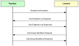

# Using the Commissioning Utility

The Commissioning Utility is used when a network node needs to learn lighting control information \(such as controlled endpoints and configured groups\) from another node in the network. It is typically used when a new remote control unit is introduced into the network and needs to learn information from an existing remote control unit.

Unlike Touchlink, the Commissioning Utility can be incorporated in the main application on the node \(and therefore use the same endpoint\). This requires:

-   a Touchlink Commissioning cluster instance as a client to be created on the endpoint on the ‘learner’ node

-   a Touchlink Commissioning cluster instance as a server to be created on the endpoint on the ‘teacher’ node

A Touchlink Commissioning cluster instance for the Commissioning Utility can be created using the function **eCLD\_ZllUtilityCreateUtility\(\)**, on both nodes.

It is the responsibility of the learner node to request the required information from the teacher node. The Commissioning Utility command set is summarised in [Table 85](#id_1fd79cfd-762e-4705-a8b7-1b111a6f449f). Commissioning Utility functions for issuing these commands are provided and are detailed in [Section 44.7.2](commissioning_utility_functions.md#id_a25799bc-364c-45c5-a87b-5821ed06ce41).

| Command                       | Identifier | Description                                                                |
| ----------------------------- | ---------- | -------------------------------------------------------------------------- |
| Endpoint information          | 0x40       | Sends information about local endpoint (from teacher to learner)           |
| Get Group Identifiers Request | 0x41       | Requests Group information from a remote node (from learner to teacher)    |
| Get Endpoint List Request     | 0x42       | Requests endpoint information from a remote node (from learner to teacher) |

Use of the above commands and associated functions is described below and is illustrated in the figure below.

**Note:** Received Commissioning Utility requests and responses are handled as ZigBee PRO events by the ZCL \(this event handling is therefore transparent to the application\).

1. **Endpoint Information command:** The teacher node first sends an Endpoint Information command containing basic information about its local endpoint \(IEEE address, network address endpoint number, Profile ID, Device ID\) to the learner node. The required function is:

-   **eCLD\_ZllUtilityCommandEndpointInformationCommandSend\(\)**
-   Note that the teacher node will already have the relevant target endpoint on the learner node from the joining process \(described in [Section 44.4](using_touchlink.md#id_f01fd7b4-9690-422c-a1bd-7aeddd320a43)\).

2. **Get Endpoint List Request:** The learner node then sends a Get Endpoint List Request to the teacher node to request information about the remote endpoints that the teacher node controls. The required function is:

-   **eCLD\_ZllUtilityCommandGetEndpointListReqCommandSend\(\)**
-   The teacher node automatically replies to the Get Endpoint List Request by sending a Get Endpoint List Response containing the requested information.

3. **Get Group Identifiers Request:** The learner node then sends a Get Group Identifiers Request to the teacher node to request a list of the lighting groups configured on the teacher node. The required function is:

-   **eCLD\_ZllUtilityCommandGetGroupIdReqCommandSend\(\)**
-   The teacher node automatically replies to the Get Group Identifiers Request by sending a Get Group Identifiers Response containing the requested information.

**Learning Process**

To complete the learning process, the learner node may need other information which can be acquired using commands/functions of the relevant cluster.

**Parent topic:**[Touchlink Commissioning Cluster](../../touchlink_cluster/topics/touchlink_commissioning_cluster.md)

