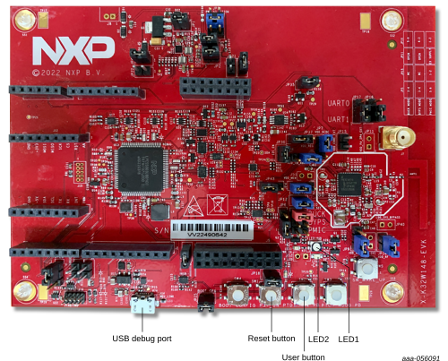

# K32W148-EVK board

The K32W148-EVK board is used for the ZigBee examples described in this document. The important LEDs and user control buttons are highlighted, as shown in the figure below.

**Parent topic:**[Examples](../topics/examples_overview.md)

