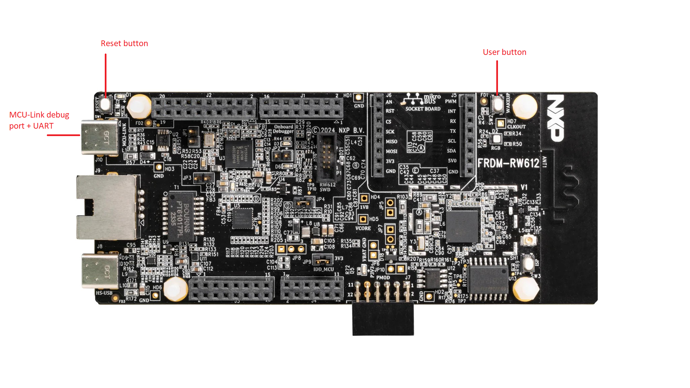

# FRDM-RW612 board

The FRDM-RW612 board is used for the ZigBee examples described in this document. The important LEDs and user control buttons are highlighted, as shown in the figure, **FRDM-RW612 board** below. 

**Parent topic:**[Examples](../topics/examples_overview.md)

