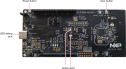

# FRDM-MCXW71 / FRDM-MCXW72 board

The FRDM-MCXW71 or the FRDM-MCXW72 board can be used for the ZigBee examples described in this document. The important LEDs and user control buttons are highlighted, as shown in the figure below.

**Parent topic:**[Examples](../topics/examples_overview.md)

