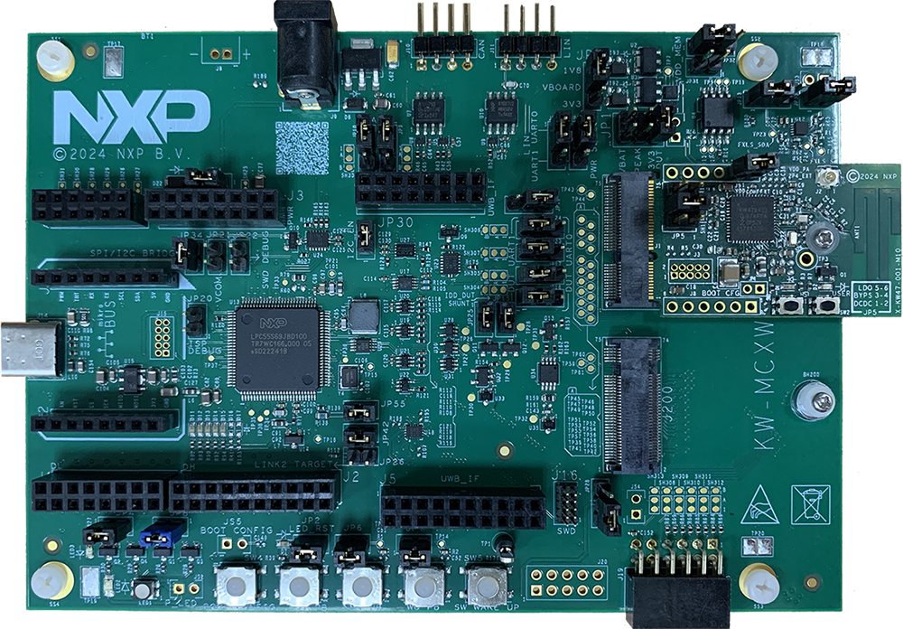

#  MCX-W71-EVK / MCX-W72-EVK board

The MCX-W71-EVK or the MCX-W72-EVK board can be used for the ZigBee examples described in this document. The board is shown in the figure below.

**Parent topic:**[Examples](../topics/examples_overview.md)

