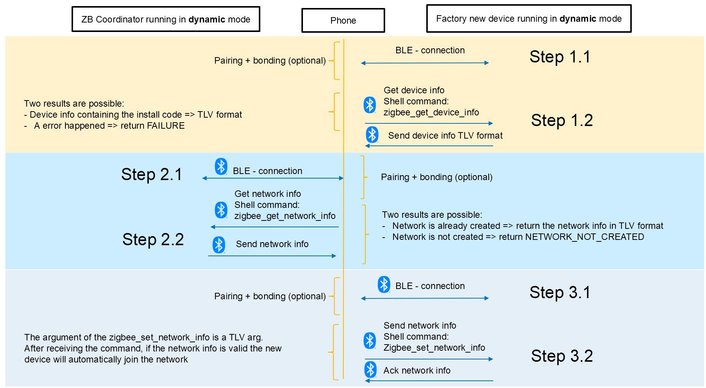
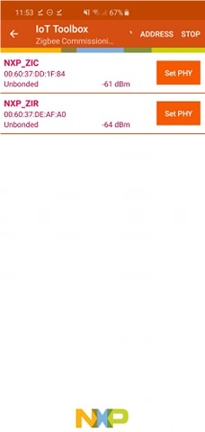
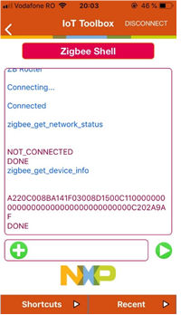
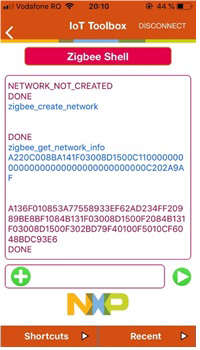
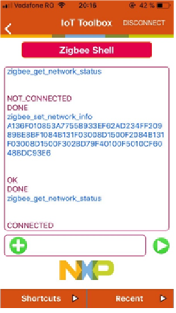

# Demo setup

The following devices are required to run the demo:
  - A Bluetooth LE mobile app running NXP IoT Toolbox supporting Bluetooth LE Wireless UART profile (ZigBee shell).
  - Device running `zigbee_coordinator_ble_uart` or `zigbee_coordinator_ble_wu` app (ZIC).
  - Device running `zigbee_router_ble_uart` or `zigbee_router_ble_wu` app (ZIR).

# Commissionning overview

This user guide explains how to use Bluetooth® LE - Zigbee applications in the context of a Zigbee commissioning
over Bluetooth LE use case.

To run the Zigbee commissioning over Bluetooth LE use case, the following applications are available:
  - `zigbee_coordinator_ble_uart`: The zigbee application part is based on the Zigbee Coordinator example and the Bluetooth LE application part is based on the Wireless UART peripheral demo. Targeted boards: MCX-W71-EVK, FRDM-MCXW71.
  - `zigbee_coordinator_ble_wu`: The application is based on the Zigbee Coordinator example and the Bluetooth LE application part is based on EdgeFast Wireless UART demo. Targeted boards: RD-RW612-BGA, FRDM-RW612.
  - `zigbee_router_ble_uart`: The zigbee application part is based on the Zigbee Router example and the Bluetooth LE application part is based on the Wireless UART peripheral demo. Targeted boards: MCX-W71-EVK, FRDM-MCXW71.
  - `zigbee_router_ble_wu`: The application is based on the Zigbee Router example and the Bluetooth LE application part is based on EdgeFast Wireless UART demo. Targeted boards: RD-RW612-BGA, FRDM-RW612.

At the first boot, after initializing the Zigbee part and the Bluetooth LE part, the applications does not try to create or join a
Zigbee network. At this point they are ready to receive commands over Bluetooth LE through the Wireless UART profile. The
communication over Bluetooth LE between the application is intermediated by a mobile application.

Bluetooth LE - Zigbee commissioning happens in three major steps:
  - Connecting and obtaining the necessary data from the device to be commissioned (`zigbee_router_ble_uart` or `zigbee_router_ble_wu`)
  - Connecting to the Zigbee coordinator to start the Zigbee network (if necessary) and obtain the commissioning data based
on the device info already acquired.
  - Connecting again to the new Zigbee device to be commissioned (`zigbee_router_ble_uart` or `zigbee_router_ble_wu`) and provision the commissioning data so that it joins the Zigbee network formed earlier by the Zigbee coordinator (`zigbee_coordinator_ble_uart` or `zigbee_coordinator_ble_wu`)

The data exchanged over Bluetooth LE is encoded in a TLV format.
Below are the shell commands supported for the commissioning scenario:
  - Zigbee Coordinator
    * `zigbee_get network_info` <TLV>
      param: install code in TLV format
      returns NETWORK_NOT_CREATED (if the network is not formed) or network info in TLV format.
    * `zigbee_create_network`
      returns NETWORK_CREATED or NETWORK_ALREADY_CREATED
    * `zigbee_get_network_status`
      returns NETWORK_CREATED or NETWORK_NOT_CREATED
  - Zigbee Router
    * `zigbee_get_device_info`
      returns FAILURE (if any error happen) or install code in TLV format
    * `zigbee_set_network_info` <TLV>
      param: network info in TLV format
      returns OK or WRONG_ARG or ALREADY_ON_NETWORK
    * `zigbee_get_network_status`
      returns CONNECTED or NOT_CONNECTED

# Step by step commissionning with IoT ToolBox

The Zigbee shell in IoT ToolBox app allows to enter the commands to commission ZIR into the Zigbee
network.

>Note: IoT ToolBox has also an application called Zigbee commissioning that simplifies the procedure and inputs the commands automatically instead of manually entering the shell commands. Unfortunately this is not yet supported due to some app incompatibility.

Open the Zigbee shell app from IoT toolbox. ZIC and ZIR appears in the list of scanned devices. Select ZIR to start the commissioning process.

## Get router device info from the router

Execute the following commands, and copy the device information data, this will be used by the coordinator on the next step.

## Create network and get commissioning data from the coordinator

Connect to ZIC, create Zigbee network and get the network information.
Follow the commands bellow, and replace `zigbee_get_network_info` TLV argument with the one retrieved from the router:

## Set commissioning data into the router

Connect back to the router, and set the network info retieved from the coordinator.
The commands are the following:

# Operating device after commissioning

After the router joins the Zigbee network, On/Off cluster can be exercised.

  - Press the `USER BUTTON` on the Router to allow Finding and Binding as a target.
  - Send the `zigbee_find` command from the mobile app to the coordinator, then `zigbee_toggle`.

>Reference: Zigbee Commissioning over Bluetooth® Low Energy User's Guide [ZBCBLEUG].
