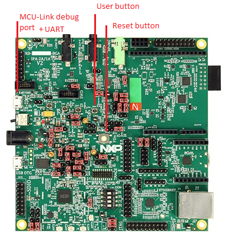
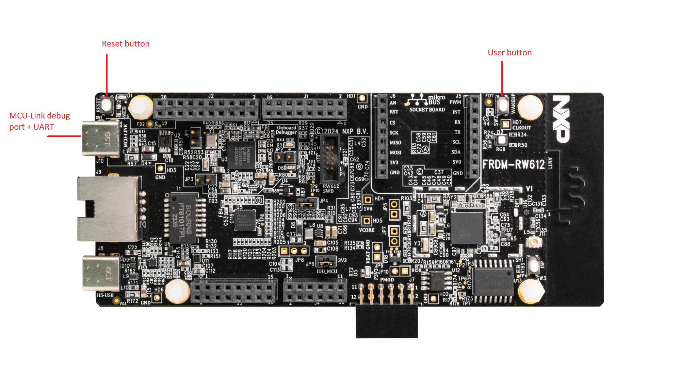

# Table of content

- [Table of content](#table-of-content)
- [Overview](#overview)
- [Software requirements](#software-requirements)
- [Hardware requirements](#hardware-requirements)
  - [RD-RW612-BGA](#rd-rw612-bga)
  - [FRDM-RW612](#frdm-rw612)
- [Examples](#examples)
  - [Loading the examples](#loading-the-examples)
- [Over The Air Upgrade (OTA)](#over-the-air-upgrade-ota)
  - [OTA Server](#ota-server)
  - [OTA Client](#ota-client)
  - [Typical OTA procedure](#typical-ota-procedure)

# Overview

This document provides information specific to the
[RW612](https://www.nxp.com/products/wireless-connectivity/wi-fi-plus-bluetooth-plus-802-15-4/wireless-mcu-with-integrated-tri-radio-1x1-wi-fi-6-plus-bluetooth-low-energy-5-4-802-15-4:RW612)
platform. It will provide software and hardware requirements and supported features.

# Software requirements

The RW612 platform supports only the GitHub MCUXPresso SDK build system using CMake and Kconfig. For more details on
how to use and build the examples for this platform, refer to the top level [README.md](../../../README.md).

To flash the demo examples executables, you'll need [J-Link](https://www.segger.com/downloads/jlink).

# Hardware requirements

Currently, the Zigbee examples on RW612 are supported on the following boards:
- RD-RW612-BGA
- FRDM-RW612

## RD-RW612-BGA



## FRDM-RW612



# Examples

Here are a list of the examples supported on RW612 platform:
- [Coordinator](../../../examples/zigbee_coordinator/README.md)
- [Router](../../../examples/zigbee_router/README.md)
- [EndDevice RX ON](../../../examples/zigbee_ed_rx_on/README.md)

## Loading the examples

1. Plug the board to the USB port (use the MCU-Link port on the board)
2. Run the following command:
```bash
JLinkExe -device RW612 -if SWD -speed 4000 -autoconnect 1
```
3. J-Link should connect to your target
4. Enter the following J-Link commands to load the executable
```bash
reset
halt
loadfile <path to your .elf file>
reset
go
exit
```

According to the example you want to run, open a serial interpreter on the correct COM/tty port to see the logs from
the application.

# Over The Air Upgrade (OTA)

RW612 platform supports Zigbee OTA cluster as a Server or as a Client.

The OTA server is demonstrated in the Coordinator example, while the OTA Client is demonstrated in the Router example.

## OTA Server

On RW612, we can load a single image in the flash at a specific location, which will then be loaded by the OTA server
cluster. This location is defined by the `FW_UPDATE_STORAGE_START` symbol from the linker script. When building the
Coordinator, refer to the map file to find this symbol and the address associated.

As an example, we can find the following:
```
0x083ff000                        FW_UPDATE_STORAGE_START = (m_app_end + 0x1)
0x003fe000                        FW_UPDATE_STORAGE_SIZE = m_app_stated_size
0x003ff000                        FW_UPDATE_STORAGE_OFFSET = (FW_UPDATE_STORAGE_START - m_flash_start)
```

In such case, the candidate image should be flashed at `0x083ff000` address in order to be parsed by the OTA Server.

As an example, the following procedure will flash the OTA Server with a Router V2 OTA image with J-Link:
```
$ JLinkExe
SEGGER J-Link Commander V7.96 (Compiled Mar  7 2024 16:52:00)
DLL version V7.96, compiled Mar  7 2024 16:51:35

Connecting to J-Link via USB...O.K.
Firmware: J-Link MCU-Link V1 compiled Dec  4 2023 11:05:21
Hardware version: V1.00
J-Link uptime (since boot): 7d 00h 17m 50s
S/N: 1064315033
USB speed mode: High speed (480 MBit/s)
VTref=3.300V


Type "connect" to establish a target connection, '?' for help
J-Link>connect
Please specify device / core. <Default>: RW612
Type '?' for selection dialog
Device>RW612
Please specify target interface:
  J) JTAG (Default)
  S) SWD
  T) cJTAG
TIF>S
Specify target interface speed [kHz]. <Default>: 4000 kHz
Speed>
Device "RW612" selected.
...
Cortex-M33 identified.
J-Link>loadbin zigbee_router_freertos_v2.ota.bin 0x083ff000
```

## OTA Client

On RW612, we use MCUBoot as a secondary bootloader to handle image upgrade using 2 partitions. We reserve the first 128K
of flash for MCUBoot, then declare 2 partitions of 4.4MB, the first one being used as the Active image and the second
one as the Candidate image.

On this platform, we support the DIRECT-XIP mode which allows to switch between both partitions without having to swap
them. This Reduces the flash wear and allows for a faster reboot after an upgrade.

When building the Router example (which supports OTA Client cluster), it will create binaries with different versions
```
zigbee_router_freertos_v1.signed.confirmed.bin
zigbee_router_freertos_v2.ota.bin
zigbee_router_freertos_v2.signed.bin
zigbee_router_freertos_v3.ota.bin
zigbee_router_freertos_v3.signed.bin
```

`.signed.confirmed`: this binary has been signed and set as confirmed with MCUBoot imgtool. This means this
image is considered permanent immediately by MCUBoot. We generate this binary only on the V1 image because it
represents the first image version running on the device.

`.signed.bin`: this binary has been signed with MCUBoot imgtool, it contains the MCUBoot header in front of the original
raw binary.

`.ota.bin`: this binary is a signed binary prepended with the Zigbee OTA header. This is the typical binary that will
be store one the OTA server and then sent to the OTA client. By default, the encryption is enabled so this OTA image
will be encrypted, starting from the `_enc_start` offset, which is right after the Nonce. We need to keep the Nonce
plain in order to be able to decrypt the image on the client side.

## Typical OTA procedure

To perform an OTA upgrade procedure, we'll use the Coordinator example as an OTA Server, and the Router example as an
OTA client. The client will boot from a V1 image, and the server will hold a V2 or V3 image.

1. Build the Coordinator example and flash it to one board
2. Build the mcuboot example from `<sdk_root>/examples/ota_examples/mcuboot_opensource`
3. Flash the mcuboot binary to board that will be the OTA client
4. Build the Router example and flash the `zigbee_router_freertos_v1.signed.confirmed.bin` binary at the address `0x18020000`
5. Refer to the [OTA Server](#ota-server) section to flash the `zigbee_router_freertos_v2.ota.bin` at the correct address on the Coordinator
6. Reset both boards and make sure to factory reset both boards to start from a clean state
7. The Router should show something similar to the following output:
```
hello sbl.
Disabling flash remapping function
Bootloader Version 2.0.0
Primary   slot: version=1.0.0+0
Image 0 Secondary slot: Image not found
Image 0 loaded from the primary slot
Bootloader chainload address offset: 0x20000
Reset_Handler address offset: 0x21000
Jumping to the image

Booting the primary slot - flash remapping is disabled
```
These logs come from MCUBoot, we can see it detected the V1 image in the primary slot and boots from it.

6. Form a network and steer on the Coordinator side, wait for the Router to join the network
7. After some time, the Router will perform an image request, you should see something similar to the following:
```
File ID = 0x0beef11e
Header Ver ID = 0x0100
Header Length ID = 0x0000
Header Control Filed = 0x0000
Manufac Code = 0x1307
Image Type = 0x0003
File Ver = 0x00000001
Stack Ver = 0x0002
Image Len = 0x00093932

query Next ret 00
Query Image Status Send 00

Query Next Image Response
Image Size 0x00094a8e
File Ver  0x00000002
Manufacture Code 0x1307
Image Type 0x0003
```
In these logs, we see the `Query Next Image Response` received from the server.

8. Then, you'll see the header verification
```
Verify the version
Current Ver = 0x00000001
Notified Ver = 0x00000002
Status = 0
Current Header String:
N X P Z B R O U T E R - R D R W 6 1 2 B G A - - - - - - - - - -
Notified Header String:
N X P Z B R O U T E R - R D R W 6 1 2 B G A - - - - - - - - - -
```
In these logs, we see the notified image version is superior to the current one, so we likely want to upgrade.
Then, we make a string comparison to determine if the image is for our device.

9.  After some time, you'll see the link key verification, on RW612 we wait to download 8k before checking the link key
```
Link Key Offset in External Flash = 0x000012e0
Internal Key[0] = 5a Downloaded Key[0] = 0x5a
Internal Key[1] = 69 Downloaded Key[1] = 0x69
Internal Key[2] = 67 Downloaded Key[2] = 0x67
Internal Key[3] = 42 Downloaded Key[3] = 0x42
Internal Key[4] = 65 Downloaded Key[4] = 0x65
Internal Key[5] = 65 Downloaded Key[5] = 0x65
Internal Key[6] = 41 Downloaded Key[6] = 0x41
Internal Key[7] = 6c Downloaded Key[7] = 0x6c
Internal Key[8] = 6c Downloaded Key[8] = 0x6c
Internal Key[9] = 69 Downloaded Key[9] = 0x69
Internal Key[10] = 61 Downloaded Key[10] = 0x61
Internal Key[11] = 6e Downloaded Key[11] = 0x6e
Internal Key[12] = 63 Downloaded Key[12] = 0x63
Internal Key[13] = 65 Downloaded Key[13] = 0x65
Internal Key[14] = 30 Downloaded Key[14] = 0x30
Internal Key[15] = 39 Downloaded Key[15] = 0x39
```
In these logs, we see the link keys match, so we proceed with the upgrade.

10. Now, you'll need to wait for a few minutes in order to receive the whole image. At the end, you should see the
following logs:
```
Upgrade End Response
Upgrade Time : 0x00000005
Current Time : 0x00000000
File Version : 0x00000002
Image Type   : 0x0003
Manufacturer : 0x1307
E_CLD_OTA_COMMAND_UPGRADE_END_RESPONSE


Switching to New Image
```
In these logs, we see the upgrade completed successfully and that the device is going to switch to the new image.

11. After a few second, the device reboots on the new image:
```
hello sbl.
Disabling flash remapping function
Bootloader Version 2.0.0
Primary   slot: version=1.0.0+0
Secondary slot: version=2.0.0+0
writing copy_done; fa_id=1 off=0x43ffe0 (0x89ffe0)
Image 0 loaded from the secondary slot
Bootloader chainload address offset: 0x460000
Reset_Handler address offset: 0x461000
Jumping to the image

Booting the secondary slot - flash remapping is enabled
```
In these logs, we can see MCUBoot detects both v1 and v2 images and chooses to boot from the v2 image. On RW612, we
support the flash remapping which allows to directly execute from the secondary slot without having to swap the images.

To upgrade to v3 image, you can shutdown the Coordinator, flash the `zigbee_router_freertos_v3.ota.bin` to the Coordinator storage
and reboot it. The Router will query the next image and detect the v3 image is available. The OTA procedure will start
the same way. At the end, MCUBoot will detect the v3 in the primary slot and boot from it.
```
hello sbl.
Disabling flash remapping function
Bootloader Version 2.0.0
Primary   slot: version=3.0.0+0
Secondary slot: version=2.0.0+0
writing copy_done; fa_id=0 off=0x43ffe0 (0x45ffe0)
Image 0 loaded from the primary slot
Bootloader chainload address offset: 0x20000
Reset_Handler address offset: 0x21000
Jumping to the image

Booting the primary slot - flash remapping is disabled
```